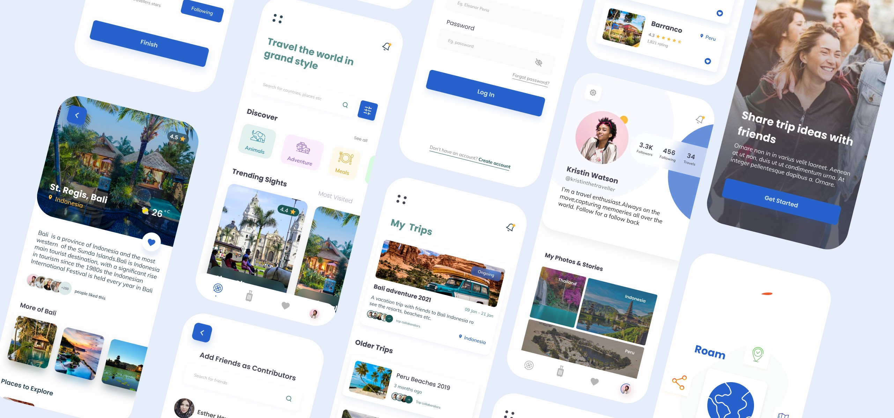

<h1 align="center">
  <a href="http://davidcobbina.com" target="_blank">davidcobbina.com</a>
</h1>

    Roam — UI / UX Case study for a travel advisory app done by <a href="https://www.linkedin.com/in/georgina-sekyi-050932175/" target="_blank">Georgina Sekyi</a> and built by <a href="https://www.linkedin.com/in/david-cobbina-7b0226119/" target="_blank">David Cobbina</a> using <strong>flutter</strong>.

    Find link to the medium article <a href="https://gynahsekyi13.medium.com/roam-ui-ux-case-study-for-a-travel-advisory-app-8094c71b3d76" target="_blank">here</a>

<a href="https://www.figma.com/proto/KF7dQnZJSrgk0E5UnE1sad/Roam?node-id=247%3A60&viewport=352%2C-1453%2C0.18740859627723694&scaling=scale-down" target="_blank">Roam Prototypes in Figma</a>

 

    

## Overall Designs

## OnBoarding

# Home

# Explore Screen Design

# Profile Screen Design

# Roam FlowChart

# WireFrames

# Roam Color Palette
